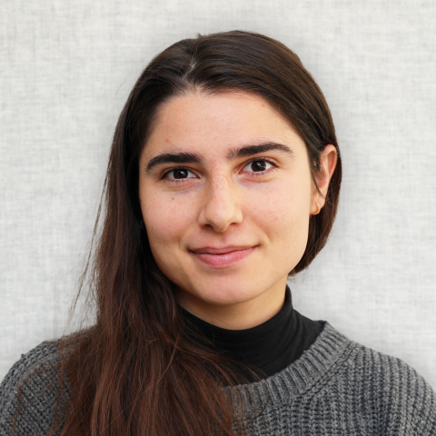
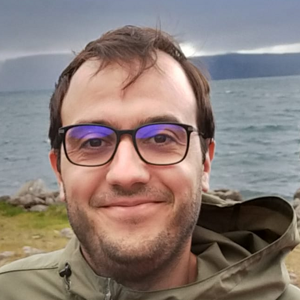
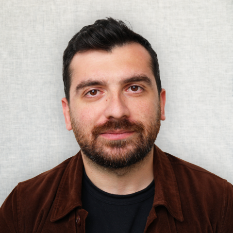
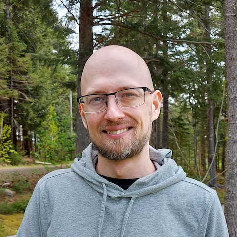
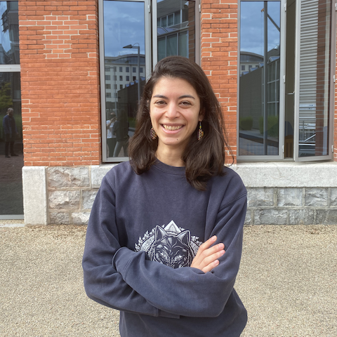

# About us

## Neuroinformatics Unit
(Systems) neuroscience & machine learning **research software engineering** group

## Team{.smaller}
## Team
::: {layout-nrow=1}

:::

## What we do
:::{.incremental}
- **Data analysis software** (anatomy, electrophysiology, functional imaging, behaviour)
- **Data management** (specifications, tools)
- **Collaborations** (data science, software development, productionisation)
:::

## Current projects
:::{.incremental}
* Data standardisation and management
* Developer tools
* Modelling
* Extracellular electrophysiology analysis
* Video behavioural analysis
* Multiphoton analysis
* Computational neuroanatomy
:::

## More details
### [neuroinformatics.dev](https://neuroinformatics.dev/)

# Course details

## Course schedule{.smaller}

**Tuesday, September 30th**
- Introduction to Python (1)

**Wednesday, October 1st**
- Introduction to Python (2)

**Thursday, October 2nd**
- Data management and sharing

**Friday, October 3rd**
- Version control and software development best practices

**Wednesday, October 8th**
- Video behavioural analysis

**Thursday, October 9th**
- Linux and high-performance computing
- General microscopy

**Monday, October 13th**
- Histology analysis

## Full details
[software-skills.neuroinformatics.dev/courses/software-skills](https://software-skills.neuroinformatics.dev/courses/software-skills.html)

## Any questions?
